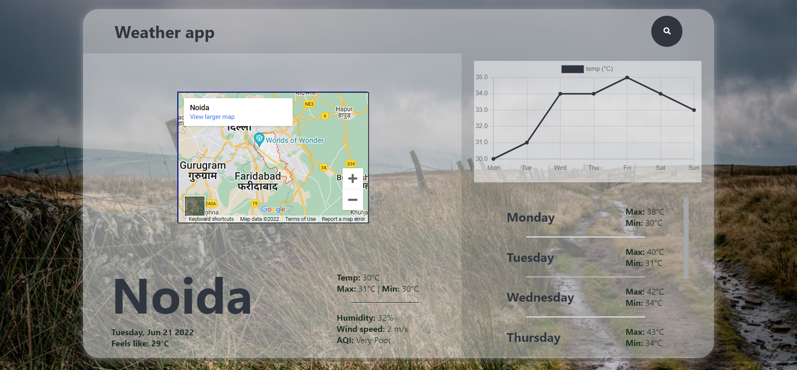

# Weather App
<br />

# About the Website


### This is a solo react web application. In this web application you can search for weather app of city you want. In main screen you will see a box of content in which you will see three sides at top navbar, at left city detail box and at right week details. You will see map of city, temperature of city, humidity, air quality wind speed of city. A graph of weekly update and maximum and minimum temperature of city for week. 
<hr/>

## Data Source for Covid-19
* [data source](https://openweathermap.org/api)
<hr/>

## Steps to run application on local server

* Clone this repository locally than to following for starting local server for backend or frontend.
  
 * <kbd>npm run dev</kbd> ==> This is the main react application after opening that folder you will see all files related to application. To start application on local server you have to run this command in terminal. Firstly you have to install npm package by npm install. 
<hr/>

## TechStacks
* React
* Redux
* NodeJS
* JavaScript
* CSS
* Media Query
* Vercel
<hr/>

## Deployed Link

```bash
  https://deepu2560-weather-app.vercel.app/
```


# Features

* ##  Sign-up


<hr />
Thank you ❤️
